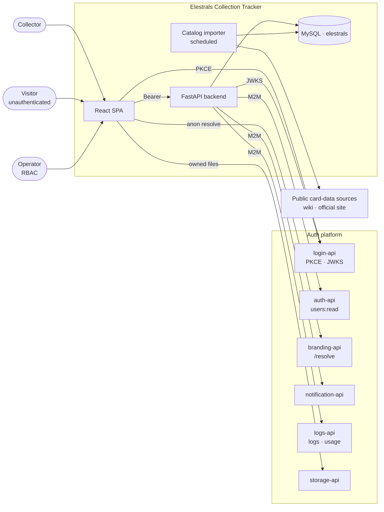

# Collection Tracker - System Context

## System Overview

A React SPA plus a FastAPI backend owning a MySQL database called `elestrals`. The system is a
**client** of the auth platform: it delegates identity, branding, notifications, platform-visible
logging, usage metering and user file storage, and owns the Elestrals domain itself — catalog,
inventory, completion and wishlist.

Two actors write to the system: the **collector** (through the SPA, always authenticated, always
scoped to their own `sub`) and the **importer job** (unattended, writing catalog rows only). One
actor reads without writing: the **visitor**, who may browse the catalog and any collection
explicitly made public.

## Context Diagram

## External Integrations

- **login-api** — the only identity authority. PKCE sign-in from the browser; JWKS validation in the
  backend. Hard dependency: no sign-in, no app.
- **auth-api** — read-only profile enrichment via the M2M admin SDK (`users:read`). Soft: absent, the
  profile page shows token claims only.
- **branding-api** — anonymous `/resolve` supplies the chrome theme. Soft: absent, built-in default.
- **notification-api** — outbound user notifications (`notifications:send|configure`). Soft: queued
  in `notification_outbox`.
- **logs-api** — error/security log forwarding (`logs:write`) and feature-usage metering
  (`usage:write`). Soft: buffered then dropped; `app_logs` retains everything regardless.
- **storage-api** — avatars as end-user `owned` files, uploaded from the browser with the user's own
  token. Soft: upload disabled, rest of app unaffected.
- **Public card-data sources** — read-only, unattended, rate-limited. The importer is the only
  component that touches them, and it never sends user data outbound.

## What this system does *not* own

Deliberately, so it never has to be reconciled: user credentials, sessions, refresh tokens, email
addresses, display names, MFA, the branding cascade, notification templates and delivery, platform
audit. All of it belongs to the platform.

## High-Level Constraints

- Must run inside the platform's existing `docker-compose.yml` project and use its MySQL instance.
- Backend layering is fixed: `Controllers → Services → Repositories → SQLAlchemy models → MySQL`.
- The browser holds only a public `client_id`; every privileged call goes through our backend.
- Our Alembic tree touches only the `elestrals` database.
- Element and rarity colours are domain constants, immune to tenant branding.
- No card image bytes are stored until written permission exists.

## Key NFR Goals

- **Feels instant on the two hot paths** — card search p95 < 150ms, inventory write p95 < 200ms.
  These are the interactions a user repeats hundreds of times in a sitting.
- **Scales to a real collection** — 10k rows in the collection table at 60fps, 10M rows total.
- **Ownership is unforgeable** — every user-scoped query filters on the validated `sub`; no
  client-supplied identifier is ever trusted for authorization.
- **Observable from the first request** — every request in `app_logs`, errors and security events in
  the platform console, feature usage metered.
- **Degrades in features, not in availability** — only login-api is a hard dependency.
- **WCAG 2.2 AA**, including a fully keyboard-operable bulk-entry path.
