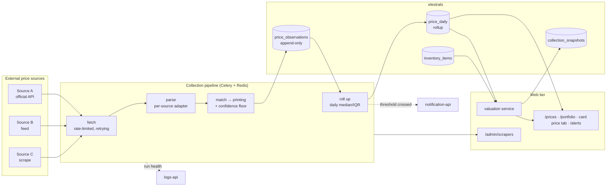

# Price Intelligence - System Context

## System Overview

A collection pipeline runs on a schedule, outside the request path: **fetch → parse → match →
observe → roll up → value → alert**. Each stage is isolated so a failure in one source, or one
parser, degrades coverage rather than breaking the product. The web tier reads only the rollup
table; it never touches the raw fact table.

## Context Diagram

## External Integrations

- **Price sources** — read-only, rate-limited, allowlisted, identified. Each is a row in
  `price_sources` with its own adapter, weight and kill switch. **No user data ever leaves.**
- **notification-api** — alert delivery, through the phase-1 outbox so an outage delays rather than
  loses.
- **logs-api** — run health as `error`/`warning` entries, plus `price.alert_fired` metering.
- **FX rate source** — one daily call for `fx_rates`; a missed day carries the previous rate forward
  and marks the conversion approximate.

## Trust boundaries

| Boundary | Control |
|---|---|
| Pipeline → external sites | allowlisted hosts, no user-supplied URLs, conservative rate limits, honest UA |
| Observations → rollups | append-only fact table; rollups always rebuildable, never authoritative |
| Rollups → user-facing figures | every figure carries observation count, window and confidence |

## High-Level Constraints

- Jobs run out of band on **Celery + Redis**, one queue per source class. Nothing in this intent may
  run inside a user request.
- `price_observations` is append-only. A correction is a new row plus an exclusion flag, never an
  edit.
- Reads for charts and valuation hit `price_daily` only.
- `sold` and `listed` are never mixed in any figure.
- Every enabled source has a recorded ToS review. This is enforced by a database constraint, not by
  discipline.

## Key NFR Goals

- **Coverage over precision** — 80% of *owned* printings with a recent sold observation matters more
  than a perfect median on the 20 most-traded cards.
- **Honest uncertainty** — a visible `low confidence` beats a precise-looking lie. This is the
  central design commitment of the intent.
- **Isolation** — one source, one parser, or one day failing must degrade coverage, never the app.
- **Auditability** — any displayed figure traces back through `price_daily` → `price_observations`
  → `source_url`.
- **Politeness** — we are a guest on every site we read, and we behave like one.
