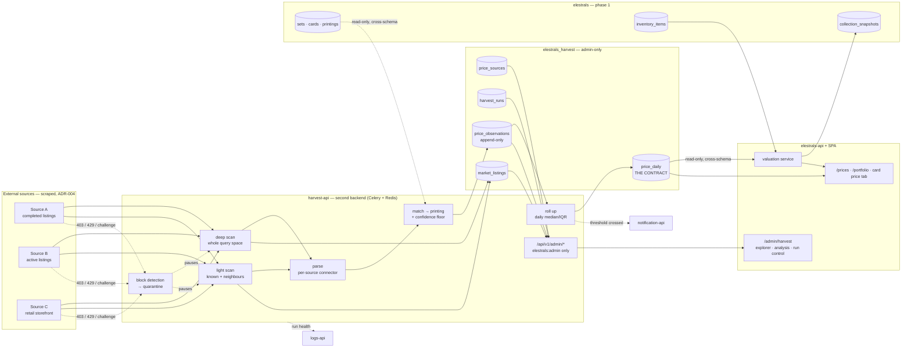

# Price Intelligence - System Context

> **Amended 2026-08-15** for ADR-004 (scrape rather than licence) and the decision to run
> collection as a **second backend** behind an **admin** scope. The pipeline stages are unchanged;
> what changed is which process they run in, which schema they write, and who may look at them.

## System Overview

Collection runs on a schedule, outside the request path, **in its own service**:
**fetch → parse → match → observe → roll up → publish**. Each stage is isolated so a failure in
one source, or one parser, degrades coverage rather than breaking the product.

Two backends, one MySQL instance, two schemas:

| Service | Owns | Reads | Never |
|---|---|---|---|
| `elestrals-api` (phase 1) | `elestrals` | `elestrals_harvest.price_daily` | writes anything in `elestrals_harvest` |
| `harvest-api` (this intent) | `elestrals_harvest` | `elestrals.sets/cards/printings/sealed_products` | writes anything in `elestrals` |

The boundary is enforced by **database grants**, not by convention. Each service connects as its
own MySQL user, and neither user holds a write grant on the other's schema. A mistake in code
therefore surfaces as a permission error at development time rather than as a corrupted table in
production.

`price_daily` is the entire contract between them. Everything else the harvester holds —
listings, run logs, match notes, rejected rows — is admin-only and never crosses the line.

## Context Diagram

## Actors

| Actor | Sees | Via |
|---|---|---|
| Collector (signed in) | price history, valuation, portfolio, alerts — **rollups only** | `elestrals-api` |
| Anonymous visitor | market overview, public card pages | `elestrals-api` |
| **Admin** (`elestrals:admin`) | every listing, run, observation, match note and rejection; the analysis surface; the run controls | `harvest-api` admin routes, rendered in the SPA's admin section |
| Operator (`elestrals:operator`) | the phase-1 catalog console — **unchanged, and not the same person by definition** | `elestrals-api` |

An admin is a strictly wider role than a collector, and a different one from the phase-1 operator.
Keeping them separate scopes means the person who can re-import the catalog is not automatically
the person who can start a scraper against a site that has asked us not to.

## External Integrations

- **Scraped sources** — read-only, allowlisted, identified, rate-limited per source. Each is a row
  in `price_sources` with its own connector, weight, terms review, risk owner and kill switch.
  **robots.txt is deliberately not obeyed** (ADR-004). **No user data ever leaves.** No personal
  data is collected: prices, dates, titles and URLs only.
- **notification-api** — alert delivery, through the phase-1 outbox so an outage delays rather than
  loses. Called by `elestrals-api`, not by the harvester.
- **logs-api** — run health as `error`/`warning` entries, plus `price.alert_fired` metering.
- **FX rate source** — one daily call for `fx_rates`; a missed day carries the previous rate forward
  and marks the conversion approximate.

## Trust boundaries

| Boundary | Control |
|---|---|
| Harvester → external sites | allowlisted hosts, no user-supplied URLs, no redirects followed off-host, per-source rate limits, honest UA with contact address |
| Harvester → `elestrals` | **read-only by grant.** The harvester cannot write the catalog, inventory or anything else phase 1 owns |
| Collection backend → `elestrals_harvest` | **read-only, and only `price_daily`.** No join reaches a listing, a run or a rejection |
| Raw harvest data → any user | `elestrals:admin` scope, checked in one dependency shared by every admin route. `403`, never a filtered `200` |
| Observations → rollups | append-only fact table; rollups always rebuildable, never authoritative |
| Rollups → user-facing figures | every figure carries observation count, window and confidence |
| Admin UI → source credentials | none held in the browser. The SPA triggers a run; `harvest-api` holds every credential |

## High-Level Constraints

- Collection runs in `harvest-api` on **Celery + Redis**, one queue per source class. Nothing in
  this intent may run inside a user request, in either service.
- Two Alembic trees. Neither service migrates the other's schema, and neither is deployed by the
  other's release job.
- `price_observations` is append-only. A correction is a new row plus an exclusion flag, never an
  edit.
- Reads for charts and valuation hit `price_daily` only.
- `sold` and `listed` are never mixed in any figure.
- Every enabled source has a recorded terms review **and a named risk owner**, both enforced by a
  database constraint rather than by discipline.
- A source in quarantine stops being asked. Quarantine is a state of the source, not a decision
  a run makes each time.

## Key NFR Goals

- **Coverage over precision** — 80% of *owned* printings with a recent sold observation matters
  more than a perfect median on the 20 most-traded cards.
- **Honest uncertainty** — a visible `low confidence` beats a precise-looking lie. This remains the
  central design commitment of the intent, and it is the reason the raw data is admin-only until
  someone has actually looked at it.
- **Isolation, now structural** — one source, one parser, one day, or the entire harvester failing
  must degrade coverage and never the app. Previously a design intention; with two services and two
  database users it is a property of the deployment.
- **Auditability** — any displayed figure traces back through `price_daily` → `price_observations`
  → `source_url`. Under ADR-004 this matters more, not less: scraped data that cannot be traced to
  a page a human can open is not evidence of anything.
- **Identifiability** — we do not hide. The user agent names the product and carries a contact
  address, so a site that objects can reach us before it blocks us. This replaces the earlier goal
  of *politeness*, which ADR-004 knowingly gave up: we are no longer behaving as a guest, and
  saying so plainly is the minimum the record deserves.
