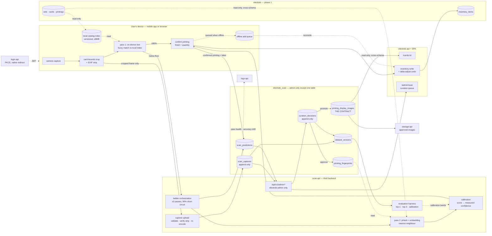

# Card Scanning — System Context

## System Overview

One capability, two surfaces, three backends. A capture is resolved by a **ladder** that starts on the
user's own device and escalates only when it must:

```text
capture → crop (on device) → pass 1: text, on device → ≥90%? stop
                                        ↓ no
                              pass 2: image match, scan-api → ≥90%? stop
                                        ↓ no
                              pass 3: new frame + hint → best candidate, or honest failure
```

Every capture is then **retained** with what was predicted and what the user confirmed. An admin
curates that pile; approved captures become the images the site displays and the labelled corpus a
future recogniser trains on. The system's accuracy is therefore a function of its use, which is the
only route to a good recogniser for a TCG nobody sells a model for.

Three backends, one MySQL instance, three schemas:

| Service | Owns | Reads | Never |
|---|---|---|---|
| `elestrals-api` (phase 1) | `elestrals` | `elestrals_harvest.price_daily`, `elestrals_scan.printing_display_images` | writes anything in `elestrals_harvest` or `elestrals_scan` |
| `harvest-api` (intent 002) | `elestrals_harvest` | `elestrals.sets/cards/printings/sealed_products` | writes anything in `elestrals` or `elestrals_scan` |
| **`scan-api`** (this intent) | `elestrals_scan` | `elestrals.sets/cards/printings` | writes anything in `elestrals` or `elestrals_harvest` |

The boundary is enforced by **database grants**, not by convention — each service connects as its own
MySQL user, and none holds a write grant on another's schema. This is the pattern intent 002
established and it is followed here without modification, because the reason has not changed: a
mistake in code should surface as a permission error in development rather than as a corrupted table
in production.

**`printing_display_images` is the entire contract** from `scan-api` to the collection backend, the
way `price_daily` is from `harvest-api`. Everything else `scan-api` holds — raw captures, predictions,
rejections, fingerprints, seeded images, dataset snapshots — is admin-only and never crosses the line.

### One deliberate difference from `harvest-api`

`harvest-api` is never on a user's request path; a scraper being slow costs coverage tomorrow.
`scan-api` is **always** on a user's request path — someone is standing in a card shop holding a card.
So its isolation requirement is about **latency** as much as availability, and its degradation mode is
specific: when `scan-api` is unreachable, the ladder falls back to pass 1 on the device, says that it
did, and the add still completes through the collection backend.

## Context Diagram



## Actors

| Actor | Sees | Via |
|---|---|---|
| Collector on mobile | scan, confirm, add, read-only collection, set completion, card detail | Expo app → `scan-api` + `elestrals-api` |
| Collector on web | the same scan flow as a third entry mode beside fast-add and the set grid | SPA → `scan-api` + `elestrals-api` |
| Collector, own captures | their own captures and outcomes; deletion of their own | `scan-api`, scoped on `user_sub` |
| **Admin** (`elestrals:admin`) | every capture, prediction, rejection and fingerprint; the curation queue; promotion to display; dataset versions | `scan-api` admin routes, rendered in the SPA's admin section |
| Anonymous visitor | approved card images on public card pages — **nothing else from this intent** | `elestrals-api` |
| The device itself | a versioned catalog index, and nothing about other users | `scan-api` index endpoint |

An admin here is the same scope as intent 002's admin, deliberately. The person who may look at
scraped listings is the person who may look at collectors' photographs; both are the raw, uneven,
pre-judgement data of this project, and splitting them would imply a distinction we do not actually
draw.

**The curation queue never shows who submitted a capture.** Curation is a judgement about a card, and
a reviewer who can see whose shoebox it came from is being given information they cannot use and
should not have.

## External Integrations

- **The camera** — the only genuinely new input class in this project. Everything about it is treated
  as untrusted: the crop happens on the device for privacy but is **verified server-side**, because
  client-side cropping is a privacy feature and never a security boundary.
- **login-api** — Authorization Code + PKCE. Verified against the platform source: `redirect_uri` is
  matched by exact string membership in a JSON allowlist with no scheme restriction
  (`authorization_service.py:74`), and the code exchange takes no client secret
  (`token_service.py:84`), so a native client needs a registration row and no platform change. The
  mobile client is a **separate public client** from the web SPA so that revoking one does not affect
  the other.
- **storage-api** — approved display images, immutable object keys. This is the path the data model's
  image-rights note anticipated for the day permission existed; that day arrives here by a different
  route than expected, via user-submitted photographs rather than the publisher's.
- **logs-api** — pass health, ladder timings, accuracy drift between dataset versions.
- **App distribution** — CI-built Android artifacts and an over-the-air channel pinned to a native
  runtime version. **No App Store or Play dependency exists anywhere in this intent**, by decision.

## Trust boundaries

| Boundary | Control |
|---|---|
| Device → `scan-api` | platform JWT via JWKS, `user_sub` scoping; upload validated on content type, magic bytes, dimensions and size, then re-encoded server-side |
| Frame → anything | cropped to card bounds and EXIF-stripped **on the device**; GPS unconditionally; the strip is re-verified server-side |
| `scan-api` → `elestrals` | **read-only by grant.** It cannot write the catalog or inventory. A scanned add goes through the collection backend's existing inventory path, as a caller |
| Collection backend → `elestrals_scan` | **read-only, and only `printing_display_images`.** No join reaches a capture, a prediction or a rejection |
| Raw captures → any user | `elestrals:admin`, checked in one dependency shared by every admin route. `403`, never a filtered `200` |
| Unapproved image → anyone | not addressable. The approval gate lives in the published projection, so an unapproved image cannot be fetched by guessing an id |
| Seeded reference image → anyone | never displayed, admin included. It exists to be fingerprinted and is deleted when an approved capture replaces it |
| Capture → curator | submitter identity withheld from the queue |
| Predictions → history | append-only. What was shown to a user is not rewritten by a later model |
| Mobile app → secrets | public `client_id` only; tokens in the platform keystore, never `AsyncStorage`; no M2M credential on a device, ever |

## Data Flows

### Inbound

| Data | Format | Validation |
|---|---|---|
| Cropped card frame | WebP/JPEG, ≤400KB, ≤1600px long edge | content type, magic bytes, dimensions, size; re-encoded; EXIF absence verified |
| OCR text from pass 1 | JSON — name, collector number, set code, edition stamp | treated as untrusted text; fuzzy-matched against the closed catalog vocabulary, never used to construct a query |
| Confirmed printing | `printing_id` + condition + quantity | must be a printing of the candidate card; the confirmation is stored as a label |
| Consent acceptance | versioned consent id | recorded per user; training and display consents are separate |
| Curation decision | `approve` / `reject` + closed reason / `relabel` | `elestrals:admin`; written append-only |

### Outbound

| Data | Consumer | Guarantee |
|---|---|---|
| Ranked candidates | mobile + web | identical shape on both surfaces; confidence is measured, never a raw score |
| `printing_display_images` | collection backend → `/cards/:id` | approved only; read-only projection; no join into private tables |
| Approved image bytes | storage-api → any visitor | immutable object key; withdrawable within a stated window |
| Dataset version export | a future recogniser-V2 intent | immutable snapshot + manifest, so an accuracy figure names its data |
| Pass health, accuracy drift | logs-api | no image content, no user identity |

## High-Level Constraints

- **Nothing in this intent writes the `elestrals` schema.** Scanned adds are a *caller* of the
  existing inventory path and inherit its merge-on-duplicate invariant and its delta-adjust undo
  (ADR-005). No new inventory semantic is introduced by a camera.
- **Three Alembic trees.** No service migrates another's schema.
- **`scan_captures`, `scan_predictions` and `curation_decisions` are append-only.** A curation
  decision is a new row. A prediction, once shown, is evidence of what the system claimed.
- **No confidence that is not measured.** The calibration bands come from the evaluation harness, and
  a release that cannot produce a harness run has not met the requirement. This is why the harness
  bolt is scheduled before any user-facing surface.
- **Pass 1 must work with no network.** Offline is not a degraded mode for a scanner; a card shop with
  bad signal is the normal case.
- **Android carries the intent.** iOS is defined and buildable but gated on a signing identity that
  does not exist; no requirement completes only on iOS.

## Key NFR Goals

- **Honest uncertainty, again.** Intent 002's central commitment was that a visible `low confidence`
  beats a precise-looking lie. Here it takes a sharper form: a percentage next to a card name is a
  claim about how often we are right, and it must be one we have measured. A raw cosine distance
  rendered as "94%" would be exactly the fabricated number this project has twice refused to display.
- **The flywheel over the model.** No amount of cleverness in the matcher substitutes for labelled
  Elestrals photographs, and every scan produces one for free. The system is designed so that ordinary
  use is data collection, and so that a user's *correction* — the most valuable label available — is
  captured rather than discarded.
- **Isolation, structurally, for the third time.** One blocked scraper must not reach a collector
  (intent 002); one slow matcher must not either. Same grants, same compose stack, same reasoning.
- **Privacy by subtraction.** The room, the hands and the faces never leave the phone. The cheapest way
  to protect data you do not need is to never receive it.
- **Auditability of a claim.** Any displayed identification traces to the capture, the passes that ran,
  the candidates each returned and the dataset version whose measured accuracy produced the
  percentage. An accuracy figure that cannot name its data is not a measurement.
