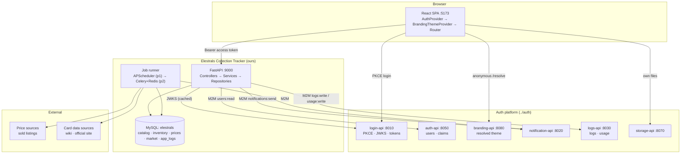

# System Architecture

## The one-paragraph version

A React SPA talks to **our** FastAPI backend. The browser signs in directly against the platform's
login-api using Authorization Code + PKCE and holds a short-lived access token in memory. Every call
to our backend carries that token as a Bearer; the backend validates it locally against cached JWKS
and derives the user from the `sub` claim. Our backend owns the `elestrals` MySQL database. Anything
that is *platform* concern — user detail, branding, notifications, platform-visible logs, usage
metering, file blobs — the backend fetches or pushes through the M2M admin SDK, using a service
account that never leaves the server.

## Component diagram

## Trust boundaries

| Boundary | What crosses it | Control |
|---|---|---|
| Browser → our API | user access token | JWKS-validated locally, `RS256` only, `iss` pinned; `sub` is the only identity we trust |
| Our API → platform | M2M service-account token | `client_credentials`, secret in the server's secret store, RBAC-limited scopes |
| Our jobs → external sites | outbound HTTP only | allowlisted hosts, per-source rate limit, no user data ever leaves |
| Browser → storage-api | user access token | storage-api forces `owned` files scoped to the caller's `sub` |

**The browser can never write logs or usage directly** — it has no `logs:write`. Client events are
relayed through `POST /api/v1/events` on our backend, which stamps the validated caller. This is the
app-starter pattern and it exists so identity cannot be spoofed.

## Identity model

The platform's end-user account is **per company, not per project**. We therefore key every row we
own on the JWT `sub` (a stable user id), stored as `user_sub CHAR(36)`. We deliberately do **not**
copy email, display name or avatar into our tables — those are enriched on read from auth-api and
cached briefly in memory. One less place for personal data to go stale or leak.

A thin `user_profiles` table holds only the app-specific bits the platform has no opinion on:
public handle, collection visibility, default currency, preferred condition grading scale.

## Logging: two destinations, one call site

The user asked for our own logging table *and* platform logging. Both, with a clear split:

| | `elestrals.app_logs` (ours) | logs-api (platform) |
|---|---|---|
| Volume | everything: debug → critical | `error`, `critical`, `security`, plus business events |
| Why | joinable against our domain tables; a scraper failure can be read next to the run it belongs to | the platform console is the single operational pane across all apps |
| Retention | 30 days `debug`/`info`, 1 year `warning`+ | platform's per-tenant retention sweep |
| Write path | synchronous, in-process | best-effort, async, **never breaks a request** |

A single `log_event()` helper writes to `app_logs` and decides whether to forward. Call sites never
choose a destination — that rule lives in one function, so it can be changed once.

## Usage metering

Product usage goes to the platform's flexible feature-usage stream via `usage.track()`, so the
console's *Feature usage* view reports real behaviour without us building analytics:

| Feature key | Subject | Quantity | `reference_1` |
|---|---|---|---|
| `inventory.item_added` | `user_sub` | items added | set code |
| `inventory.bulk_imported` | `user_sub` | rows | import id |
| `collection.valued` | `user_sub` | 1 | valuation basis |
| `catalog.searched` | `user_sub` | 1 | — |
| `price.alert_fired` | `user_sub` | 1 | printing id |
| `listing.created` | `user_sub` | 1 | listing id |

## Job architecture

Phase 1 needs one scheduled job (catalog import) and runs it in-process with APScheduler. Phase 2
changes the shape of the problem — dozens of sources, retries, backoff, partial failure, and runs
that must not block the API — so it moves to **Celery + Redis** with one queue per source class.
This is planned as a phase-2 unit, not retrofitted under pressure.

Every run is a row in `scrape_runs` / `catalog_imports` before it starts, so a crashed job is
visible as a run that never finished rather than as silence.

## Failure policy

| Dependency | If it is down |
|---|---|
| login-api | users cannot sign in — hard fail, show the platform status link |
| auth-api | profile shows the token's claims un-enriched; app fully usable |
| branding-api | fall back to our built-in default theme |
| logs-api | queue and drop after a bounded buffer; `app_logs` still has everything |
| notification-api | alerts queue in `notification_outbox`, retried; never lost silently |
| storage-api | avatar/photo upload disabled with an inline message; rest of app fine |
| a price source | that source's run is marked failed; valuation falls back to remaining sources and lowers its stated confidence |

The principle: **the platform is a dependency for identity and nothing else.** Every other platform
service degrades to a reduced feature, not an outage.
